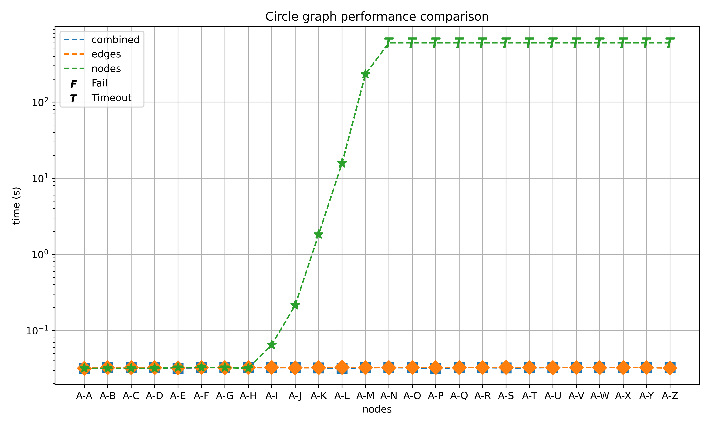
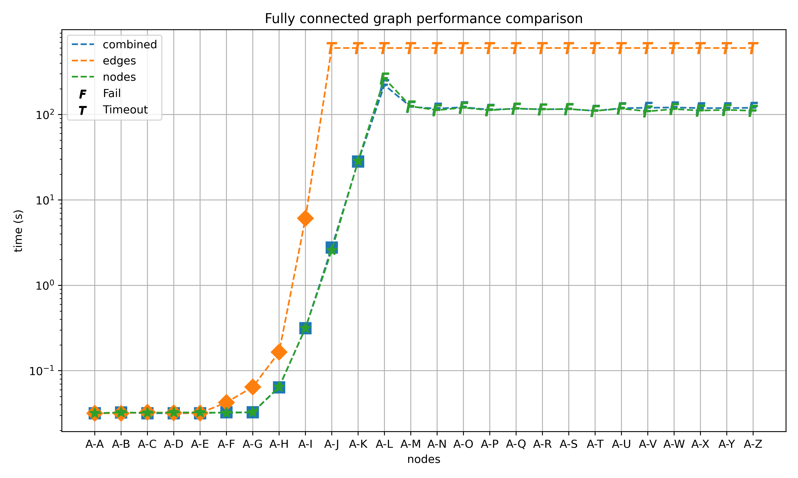
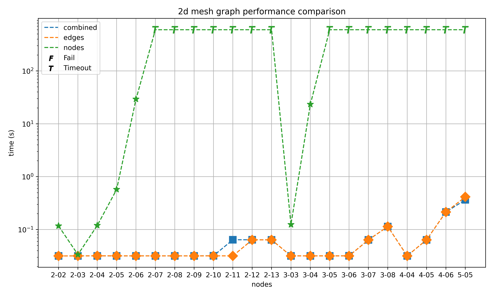
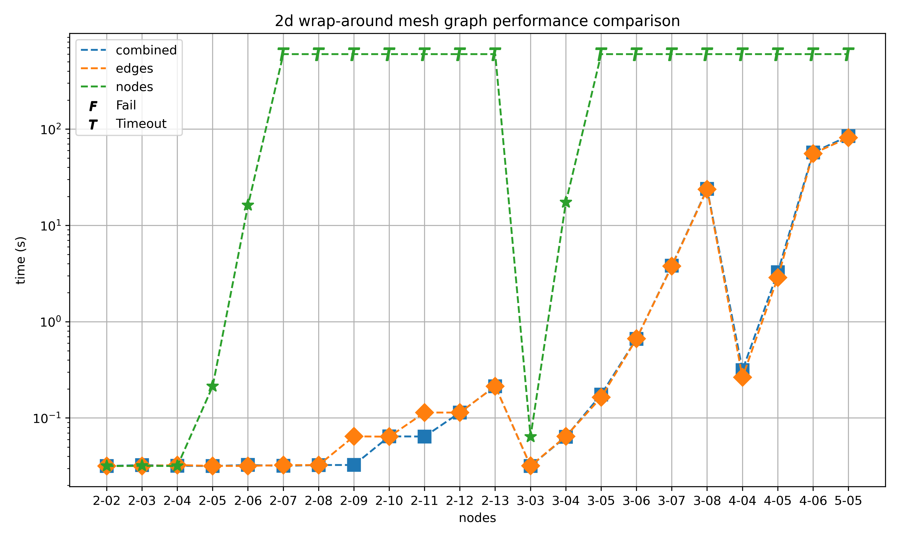

# FLP-LOG (2nd project to Functional and Logic Programming course at FIT, BUT)
```
  case: Search of unique hamiltonian cycles in a graph implemented in Prolog.
author: David Mihola (xmihol00)
 email: xmihol00@stud.fit.vutbr.cz
  date: 28. 4. 2024
```

## Directory structure
```
├── hand_solved_graphs/    - graphs with already found all possible unique hamiltonian cycles and scripts to test the implemented algorithms against them
├── main.pl                - implementation of the algorithm with multiple main functions for various tests
├── Makefile               - commands for building various executables each launching different main function 
├── performance_graphs/    - generated unsolved graphs for performance testing, scripts to evaluate the performance and performance plots of measured results
└── README.md
```

## Implementation details
There are two implemented solutions solving the problem of finding the set of all hamiltonian cycles. Both solutions use the Prolog database for storing nodes and edges, which should ensure their $O(1)$ lookup, considering that the database is a reasonably balanced hash table.

### Solution using edges as the search space
This is the common solution, where paths without repeating nodes starting and finishing in a given node are searched and then deduplicated to ensure uniqueness of each solution. The time complexity, considering that existence of an edge can be evaluated in $O(1)$, of this algorithm is $O(V^E) \cdot O(V)$, where $V$ is the number of nodes in a graph, $E$ is the average branching factor, $O(V^E)$ is the time required for finding a solution and $O(V)$ is the time required for deduplication of solutions. Already found solutions are stored into the Prolog database, the linear node time complexity of deduplication stands for rotating and reversing a newly found solution and evaluating its existence in the database.

### Solution using nodes as the search space
This is a less common solution. First, unique permutations of nodes are generated. Unique in this case means that no two permutations represent the same potential cycle, ensured by the following:
* for graphs with odd number of nodes:
  1. regular permutations are computed on the set of nodes with two nodes excluded,
  2. the mirror symetrii, i.e. sequences which are the same as their reversals, is broken by extending the permutations with sequences produced with inserting one of the excluded nodes to each of the generated permutations only up to the half of the sequence length.
  3. the rotational symetrii, i.e sequences which are the same when correctly rotated, is broken by prepending the second excluded node to the generated permutations.  
* for graphs with even number of nodes:
  1. regular permutations are computed on the set of nodes with three nodes excluded,
  2. same as step 2 in graphs with odd numbers,
  3. same as step 3 in graphs with odd numbers,
  4. permutations are extended by sequences produced by inserting the last excluded node to all possible indices of each so far generated permutation.

Then each of these permutations is checked against the database of edges if there is a circular path in between the nodes. The time complexity of this solution is $O((V-1)!)  \cdot O(V)=O(V!)$, where $(V-1)!$ is the number of unique permutations.

## Performance analysis
Given the time complexities of the two solutions, we can already tell that the first solution will outperform the second one on most graphs. The small subset of graphs, where the second solution is superior, are close to or fully connected graphs, i.e. the number of edges must be much larger than the number of nodes. This theoretical finding is also well supported by the following measurements on four types of graphs: 
|  |  |
|--|--|
|  |  |

Consequently, the final algorithm first computes the complexity of the two solutions and then chooses the in theory faster one (*combined* plot in the above graphs).

## Tests
The prepared tests can be run from the root directory with `./hand_solved_graphs/test_all.sh` for testing the final solution or with `./hand_solved_graphs/test_all_test_print.sh` for testing the separate solutions as well as the combined one.
